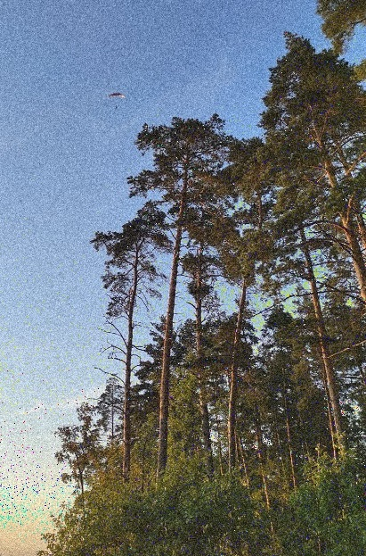
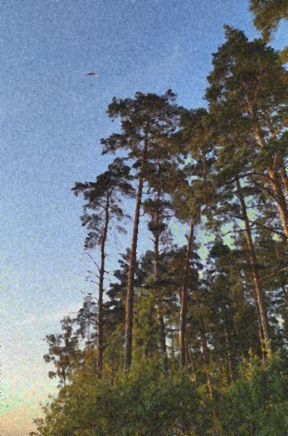

# ImageProcessingLab2
**Team:** Напылов Евгений Игоревич, Ткачев Алексей Игоревич, Пестреев Даниил Сергеевич. 381806-2   
**Video**: https://youtu.be/sqWz0wiJ38U    
***   
[OPENCV] cv2.medianBlur() - [OUR FILTER] median_filter() = -3.146 sec.   
MSE median cv2 & our = 4.695 (99 %)   
[OPENCV] cv2.blur() - [OUR FILTER] averaging_filter = -16.879 sec.   
MSE average cv2 & our = 144.689 (99 %)   
MSE our average & median = 207.531 (99 %)   

**Noise image**  
   

**Median filter**    
  

**Average filter**   
    
