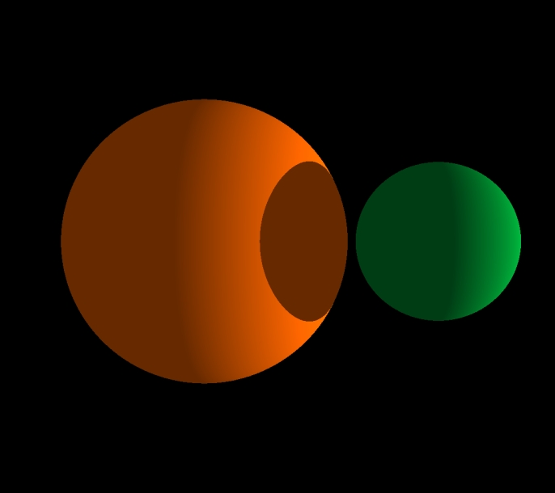

# Computer Graphics (spring 2020) Lab: Shaders and OpenGL
***
Qt 5.14

    

Управление:   

W/S - вперед/назад   

A/D - поворот влево/вправо 

T/G F/H R/Y - все координаты camera.position   

I/K J/L U/O - расположение света   

Space - дополнительный источник света   

Z/C - яркость

C++; QT 5.14; OpenGL; Shaders; VS19
